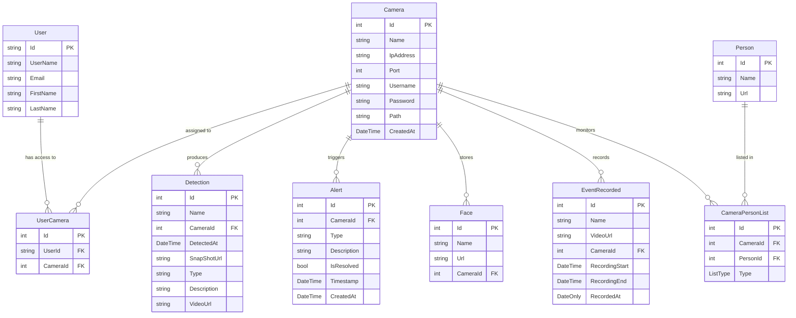

# 🛡️ CamGuard — Smart Surveillance System Backend

A comprehensive **ASP.NET Core Web API** backend for an intelligent surveillance platform. The system manages cameras, users, face detection, event recordings, and real-time alert notifications using **SignalR**.

---

## 📑 Table of Contents

- [Architecture Overview](#-architecture-overview)
- [Technology Stack](#-technology-stack)
- [Project Structure](#-project-structure)
- [Database Schema & Entities](#-database-schema--entities)
- [Entity Relationship Diagram](#-entity-relationship-diagram)
- [Enumerations](#-enumerations)
- [Authentication & Authorization](#-authentication--authorization)
- [API Reference](#-api-reference)
  - [Account (Auth)](#1-account-authentication)
  - [User Management](#2-user-management)
  - [Camera](#3-camera)
  - [User-Camera Assignments](#4-user-camera-assignments)
  - [Alert](#5-alert)
  - [Detection](#6-detection)
  - [Face](#7-face)
  - [Event Recording](#8-event-recording)
  - [Image](#9-image)
- [Real-Time Alerts (SignalR)](#-real-time-alerts-signalr)
- [API Response Format](#-api-response-format)
- [Getting Started](#-getting-started)
- [Configuration](#️-configuration)

---

## 🏗 Architecture Overview

The project follows **Clean Architecture** (Onion Architecture) with four layers:

```
┌─────────────────────────────────────────────┐
│          Smart_Surviellance (API)            │  ← Presentation Layer
│    Controllers, Program.cs, Startup          │
├─────────────────────────────────────────────┤
│            Application                       │  ← Business Logic Layer
│    Services, DTOs, Interfaces                │
├─────────────────────────────────────────────┤
│            Infrastructure                    │  ← Data Access Layer
│    DbContext, Repositories, SignalR,         │
│    External Services, Migrations             │
├─────────────────────────────────────────────┤
│              Domain                          │  ← Core Layer
│    Entities, Enums                           │
└─────────────────────────────────────────────┘
```

**Dependency flow:** API → Application → Domain ← Infrastructure

---

## 🧰 Technology Stack

| Component | Technology |
|---|---|
| **Framework** | ASP.NET Core 8.0 |
| **Language** | C# |
| **Database** | SQL Server |
| **ORM** | Entity Framework Core |
| **Authentication** | ASP.NET Identity + JWT Bearer |
| **Real-time** | SignalR |
| **API Docs** | Swagger / OpenAPI |

---

## 📁 Project Structure

```
Smart_Surviellance/
│
├── Domain/                          # Core entities & enums
│   ├── Entities/
│   │   ├── User.cs                  # Extends IdentityUser
│   │   ├── Camera.cs                # Surveillance camera
│   │   ├── UserCamera.cs            # Many-to-many: User ↔ Camera
│   │   ├── Alert.cs                 # Security alerts
│   │   ├── Detection.cs             # AI detections
│   │   ├── Person.cs                # Known persons
│   │   ├── CameraPersonList.cs      # Person whitelist/blacklist per camera
│   │   ├── Face.cs                  # Face images per camera
│   │   └── EventRecorded.cs         # Recorded video events
│   └── Enums/
│       ├── ListType.cs              # Whitelist / Blacklist / Unknown
│       └── UserRole.cs              # Admin / User
│
├── Application/                     # Business logic
│   ├── Common/
│   │   └── ApiResponse.cs           # Standardized API response wrapper
│   ├── Dto/                         # Data Transfer Objects (24 DTOs)
│   ├── Interfaces/                  # Repository contracts
│   └── Services/
│       ├── Interfaces/              # Service contracts
│       └── Implementations/         # Service implementations
│
├── Infrastructure/                  # Data access & external services
│   ├── Data/
│   │   ├── ApplicationDbContext.cs   # EF Core DbContext
│   │   └── Seed/                    # Identity data seeding
│   ├── Repositories/                # Repository implementations
│   ├── Services/                    # Infrastructure services
│   ├── SignalR/                     # Real-time hub
│   └── Migrations/                  # EF Core migrations
│
└── Smart_Surviellance/              # API presentation layer
    ├── Controllers/                 # 9 API controllers
    ├── Program.cs                   # App entry point & DI config
    ├── appsettings.json             # Configuration
    └── wwwroot/                     # Static files (images, videos)
```

---

## 🗄 Database Schema & Entities

### 1. User

Extends ASP.NET Identity's `IdentityUser` — inherits `Id`, `UserName`, `Email`, `PasswordHash`, etc.

| Column | Type | Description |
|---|---|---|
| `Id` | `string` (GUID) | Primary key (from IdentityUser) |
| `UserName` | `string` | Unique username |
| `Email` | `string` | Email address |
| `FirstName` | `string` | First name |
| `LastName` | `string` | Last name |
| *(inherited)* | — | PasswordHash, PhoneNumber, etc. |

**Relationships:** One-to-Many → `UserCamera`

---

### 2. Camera

| Column | Type | Description |
|---|---|---|
| `Id` | `int` | Primary key (auto-increment) |
| `Name` | `string` | Human-readable camera name |
| `IpAddress` | `string` | Camera network IP |
| `Port` | `int` | RTSP/stream port (e.g. 554) |
| `Username` | `string` | Camera auth username |
| `Password` | `string` | Camera auth password |
| `Path` | `string` | RTSP stream path (e.g. `/h264`) |
| `CreatedAt` | `DateTime` | UTC creation timestamp |

**Relationships:**
- One-to-Many → `UserCamera`, `Detection`, `Face`, `EventRecorded`, `CameraPersonList`

---

### 3. UserCamera *(Join Table)*

Many-to-many relationship between **User** and **Camera**. Controls which users can access which cameras (role-based access).

| Column | Type | Description |
|---|---|---|
| `Id` | `int` | Primary key |
| `UserId` | `string` | FK → User.Id |
| `CameraId` | `int` | FK → Camera.Id |

---

### 4. Alert

| Column | Type | Description |
|---|---|---|
| `Id` | `int` | Primary key |
| `CameraId` | `int` | Which camera triggered the alert |
| `Type` | `string` | Alert category (e.g. "Intrusion") |
| `Description` | `string` | Detailed description |
| `IsResolved` | `bool` | Resolution status (default: `false`) |
| `Timestamp` | `DateTime` | When the event occurred |
| `CreatedAt` | `DateTime` | UTC record creation time |

---

### 5. Detection

| Column | Type | Description |
|---|---|---|
| `Id` | `int` | Primary key |
| `Name` | `string` | Detection label |
| `CameraId` | `int` | FK → Camera.Id |
| `DetectedAt` | `DateTime` | UTC timestamp of detection |
| `SnapShotUrl` | `string?` | URL to snapshot image |
| `Type` | `string` | Detection type |
| `Description` | `string` | Details about the detection |
| `VideoUrl` | `string?` | URL to associated video |

**Relationships:** Many-to-One → `Camera` (Restrict delete)

---

### 6. Person

| Column | Type | Description |
|---|---|---|
| `Id` | `int` | Primary key |
| `Name` | `string` | Person's name |
| `Url` | `string?` | Reference image URL |

**Relationships:** One-to-Many → `CameraPersonList`, `Detection`

---

### 7. CameraPersonList

Assigns a **Person** to a **Camera**'s whitelist, blacklist, or unknown list.

| Column | Type | Description |
|---|---|---|
| `Id` | `int` | Primary key |
| `CameraId` | `int` | FK → Camera.Id |
| `PersonId` | `int` | FK → Person.Id |
| `Type` | `ListType` | Enum: Whitelist / Blacklist / Unknown |

**Constraints:** Unique index on `(CameraId, PersonId)`

---

### 8. Face

| Column | Type | Description |
|---|---|---|
| `Id` | `int` | Primary key |
| `Name` | `string` | Label / person name |
| `Url` | `string` | Stored face image URL |
| `CameraId` | `int` | FK → Camera.Id |

**Relationships:** Many-to-One → `Camera` (Restrict delete)

---

### 9. EventRecorded

| Column | Type | Description |
|---|---|---|
| `Id` | `int` | Primary key |
| `Name` | `string` | Event name/label |
| `VideoUrl` | `string` | URL to recorded video |
| `CameraId` | `int` | FK → Camera.Id |
| `RecordingStart` | `DateTime` | Recording start time |
| `RecordingEnd` | `DateTime` | Recording end time |
| `RecordedAt` | `DateOnly` | Date of recording |

**Relationships:** Many-to-One → `Camera` (Restrict delete)

---

## 📊 Entity Relationship Diagram



---

## 🏷 Enumerations

### ListType
| Value | Name | Description |
|---|---|---|
| 1 | `Whitelist` | Authorized person |
| 2 | `Blacklist` | Restricted person |
| 3 | `Unknown` | Unclassified |

### UserRole
| Value | Name | Description |
|---|---|---|
| 1 | `Admin` | Full system access |
| 2 | `User` | Restricted to assigned cameras |

---

## 🔐 Authentication & Authorization

### JWT Bearer Token

The system uses **ASP.NET Identity** for user management and **JWT tokens** for API authentication.

**Flow:**
1. Client calls `POST /api/account/login` with email + password
2. Server validates credentials and returns a JWT token
3. Client includes token in subsequent requests: `Authorization: Bearer <token>`
4. Non-admin users only see data for cameras assigned via `UserCamera`

**Token Configuration:**
- Issuer validation: ✅
- Audience validation: ✅
- Lifetime validation: ✅
- Signing key: HMAC-SHA256

**SignalR Authentication:**
WebSocket connections pass the JWT via query string: `?access_token=<token>`

---

## 📡 API Reference

All endpoints return the standard `ApiResponse<T>` wrapper (see [API Response Format](#-api-response-format)).

Base URL: `http://localhost:5198` (development)

---

### 1. Account (Authentication)

| Method | Endpoint | Description |
|---|---|---|
| `POST` | `/api/account/register` | Register a new user |
| `POST` | `/api/account/login` | Login and get JWT token |

#### Register
```json
POST /api/account/register
{
  "email": "user@example.com",
  "password": "SecurePass123",
  "firstName": "John",
  "lastName": "Doe",
  "userName": "johndoe"
}
```

#### Login
```json
POST /api/account/login
{
  "email": "user@example.com",
  "password": "SecurePass123"
}
```

**Response:**
```json
{
  "isSuccess": true,
  "data": {
    "token": "eyJhbGciOi...",
    "email": "user@example.com",
    "roles": ["Admin"]
  }
}
```

---

### 2. User Management

| Method | Endpoint | Description |
|---|---|---|
| `POST` | `/api/usermanagement/create-user` | Create a new user |
| `GET` | `/api/usermanagement/get-all-users` | Get all users |
| `GET` | `/api/usermanagement/get-user-by-email?email=` | Find user by email |
| `GET` | `/api/usermanagement/get-user-by-id?id=` | Find user by ID |
| `PUT` | `/api/usermanagement/update-user` | Update a user |
| `DELETE` | `/api/usermanagement/delete-user?id=` | Delete a user |

#### Create User
```json
POST /api/usermanagement/create-user
{
  "email": "jane@example.com",
  "password": "Pass123!",
  "firstName": "Jane",
  "lastName": "Smith",
  "userName": "janesmith"
}
```

#### Update User
```json
PUT /api/usermanagement/update-user
{
  "id": "user-guid-here",
  "email": "jane@example.com",
  "firstName": "Jane",
  "lastName": "Smith",
  "userName": "janesmith",
  "password": "NewPass456!"
}
```

---

### 3. Camera

| Method | Endpoint | Description |
|---|---|---|
| `POST` | `/api/camera` | Create a camera |
| `GET` | `/api/camera` | Get all cameras |
| `GET` | `/api/camera/{id}` | Get camera by ID |
| `GET` | `/api/camera/byid/{id}` | Get camera details by ID |
| `GET` | `/api/camera/{id}/webrtc` | Get WebRTC stream info |
| `GET` | `/api/camera/ai` | Get all cameras for AI processing |
| `PUT` | `/api/camera/{id}` | Update a camera |
| `DELETE` | `/api/camera/{id}` | Delete a camera |

#### Create Camera
```json
POST /api/camera
{
  "name": "Front Gate",
  "ipAddress": "192.168.1.100",
  "port": 554,
  "username": "admin",
  "password": "cam123",
  "path": "/h264"
}
```

---

### 4. User-Camera Assignments

| Method | Endpoint | Description |
|---|---|---|
| `POST` | `/api/usercamera/user/{userId}/camera/{cameraId}` | Assign camera to user |
| `DELETE` | `/api/usercamera/user/{userId}/camera/{cameraId}` | Remove camera from user |
| `GET` | `/api/usercamera/user/{userId}/cameras` | Get user's assigned cameras |
| `GET` | `/api/usercamera/user/{userId}/UnassignedCameras` | Get cameras NOT assigned to user |

---

### 5. Alert

| Method | Endpoint | Description |
|---|---|---|
| `POST` | `/api/alerts` | Create a new alert |
| `GET` | `/api/alerts` | Get all alerts |
| `PUT` | `/api/alerts/{alertId}/resolve` | Mark alert as resolved |

#### Create Alert
```json
POST /api/alerts
{
  "cameraId": 1,
  "type": "Intrusion",
  "description": "Unknown person detected near entrance",
  "timestamp": "2026-05-07T20:00:00Z"
}
```

---

### 6. Detection

| Method | Endpoint | Description |
|---|---|---|
| `POST` | `/api/detection` | Create a detection record |
| `GET` | `/api/detection` | Get all detections |
| `GET` | `/api/detection/camera/{cameraId}` | Get detections by camera |
| `GET` | `/api/detection/day/{date}` | Get detections by date |

#### Create Detection
```json
POST /api/detection
{
  "name": "Person Detected",
  "description": "Unknown individual near Zone A",
  "type": "FaceDetection",
  "cameraId": 1,
  "snapshotUrl": "https://example.com/snapshot.jpg",
  "videoUrl": "https://example.com/clip.mp4"
}
```

---

### 7. Face

| Method | Endpoint | Description |
|---|---|---|
| `POST` | `/api/face/add-face` | Upload a face image (multipart form) |
| `GET` | `/api/face/get-faces/{cameraId}` | Get faces for a camera |
| `GET` | `/api/face/get-all-faces` | Get all faces |
| `DELETE` | `/api/face/delete-face/{faceId}` | Delete a face |

#### Add Face (multipart/form-data)
```
POST /api/face/add-face
Content-Type: multipart/form-data

cameraId: 1
name: "John Doe"
file: <image file>
```

---

### 8. Event Recording

| Method | Endpoint | Description |
|---|---|---|
| `POST` | `/api/eventrecording/CreateEventRecorded` | Create an event recording |
| `GET` | `/api/eventrecording/GetAllEventRecorded` | Get all recordings |
| `GET` | `/api/eventrecording/GetEventRecordedById/{id}` | Get recording by ID |
| `GET` | `/api/eventrecording/GetByCamera/{cameraId}` | Get recordings by camera |
| `GET` | `/api/eventrecording/GetByDate/{date}` | Get recordings by date |

#### Create Event Recording (multipart/form-data)
```
POST /api/eventrecording/CreateEventRecorded
Content-Type: multipart/form-data

name: "Motion Event"
cameraId: 1
recordingStart: "2026-05-07T20:00:00Z"
recordingEnd: "2026-05-07T20:05:00Z"
videoFile: <video file>
```

---

### 9. Image

| Method | Endpoint | Description |
|---|---|---|
| `POST` | `/api/image/upload` | Upload an image (multipart form) |

**Response:**
```json
{
  "imageUrl": "http://localhost:5198/Images/filename.jpg",
  "imagePath": "/path/to/saved/file.jpg"
}
```

---

## 📡 Real-Time Alerts (SignalR)

The system provides real-time alert notifications through a **SignalR Hub**.

| Property | Value |
|---|---|
| **Hub URL** | `/hub/alerts` |
| **Event Name** | `ReceiveAlert` |
| **Auth** | JWT via query string `?access_token=<token>` |

### JavaScript Client Example
```javascript
const connection = new signalR.HubConnectionBuilder()
  .withUrl("http://localhost:5198/hub/alerts", {
    accessTokenFactory: () => "your-jwt-token"
  })
  .withAutomaticReconnect()
  .build();

connection.on("ReceiveAlert", (alertData) => {
  console.log("New alert:", alertData);
});

await connection.start();
```

---

## 📦 API Response Format

All API responses are wrapped in a standardized `ApiResponse<T>` object:

```json
{
  "isSuccess": true,
  "message": "Optional message",
  "data": { }
}
```

| Field | Type | Description |
|---|---|---|
| `isSuccess` | `bool` | Whether the operation succeeded |
| `message` | `string?` | Optional message (error details, etc.) |
| `data` | `T?` | The response payload (null on some failures) |

---

## 🚀 Getting Started

### Prerequisites
- **.NET 8 SDK**
- **SQL Server** (LocalDB or full instance)
- **Node.js** *(optional, for SignalR client testing)*

### Setup

1. **Clone the repository**
   ```bash
   git clone https://github.com/Ahmed-Saleh-Hanafi/graduation-project-smart-surveillance.git
   cd backend/Smart_Surviellance
   ```

2. **Update the connection string** in `Smart_Surviellance/appsettings.json`:
   ```json
   {
     "ConnectionStrings": {
       "DefaultConnection": "Server=.;Database=SmartSurveillanceDB;Trusted_Connection=True;MultipleActiveResultSets=true;TrustServerCertificate=True"
     }
   }
   ```

3. **Apply migrations and run**
   ```bash
   dotnet ef database update --project Infrastructure --startup-project Smart_Surviellance
   dotnet run --project Smart_Surviellance
   ```

4. **Access Swagger UI** at `http://localhost:5198/swagger`

### Default Seed Data
On startup, the system seeds default roles (`Admin`, `User`) and an admin account via `IdentitySeeder`.

---

## ⚙️ Configuration

### appsettings.json

```json
{
  "ConnectionStrings": {
    "DefaultConnection": "Server=.;Database=SmartSurveillanceDB;..."
  },
  "JWT": {
    "Key": "<your-signing-key>",
    "Issuer": "YourApp",
    "Audience": "YourAppUsers"
  }
}
```

### CORS
The API is configured with an `AllowAll` CORS policy for development, accepting any origin with credentials.

### Static Files
Images and videos are served from `wwwroot/` via `app.UseStaticFiles()`.

---

> **Note:** This project is a graduation project for a Smart Surveillance System. For questions or contributions, please refer to the repository issues page.
